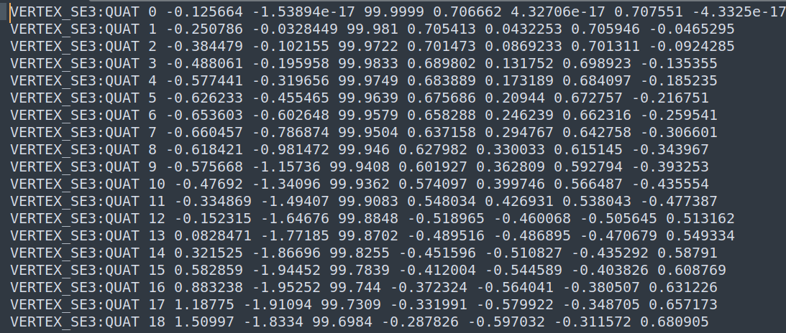
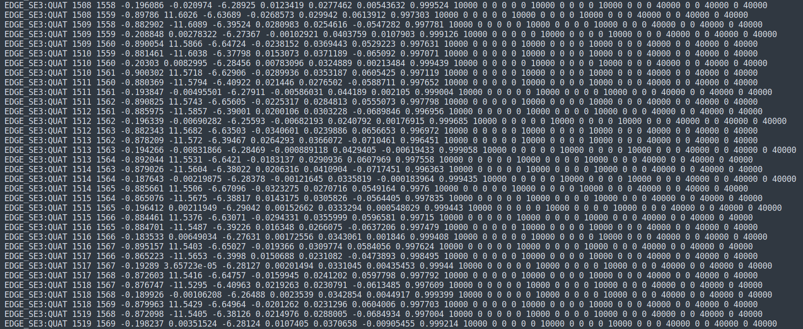
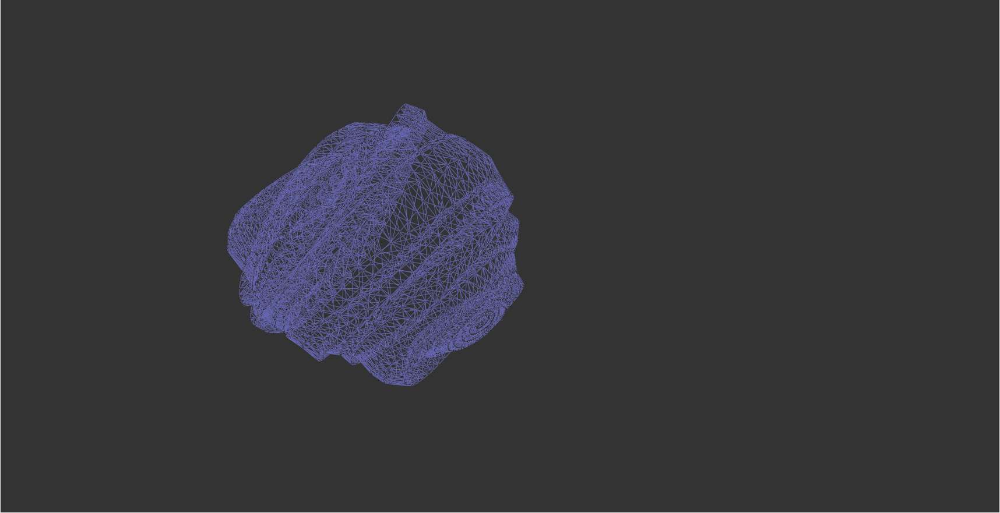
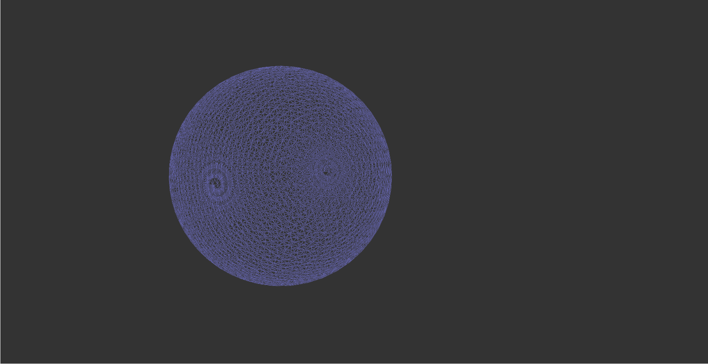

<div>
<a herf="./README.zh-CN.md">简体中文</a> |
<a herf="./README.zh-CN.md">English</a>
</div>

# poseGraphOpt
Pose graph optimization using G2O. This project contains:

- Pose graph optimization using `VertexSE3` and `EdgeSE3` defined in g2o/types/slam
- Pose graph optimization using custom `VertexSE3` and `EdgeSE3`

## 1. Dependencies

- [Ceres 2.1.0 Installation Guide](http://ceres-solver.org/installation.html)  
- [G2O 20230223 Installation Guide](https://github.com/RainerKuemmerle/g2o/releases)
- [Eigen 3.4 Installation Guide](https://gitlab.com/libeigen/eigen/-/releases/3.4.0)
- [Sophus 1.22.10 Installation Guide](https://github.com/strasdat/Sophus/releases/tag/1.22.10)
- Note that `g2o_viewer` needs to be installed properly.

## 2. Breakdown of Pose Graph Optimization
```shell
poseGraphOpt
├── cmake                                # cmake script folder 
│   ├── FindEigen3.cmake
│   └── FindG2O.cmake
├── CMakeLists.txt                       # Root CMakeLists.txt
├── g2oMyself                            # Custom vertex and edge folder
│   ├── CMakeLists.txt
│   ├── include                          # Header files
│   │   ├── EdgeSE3.h                    # EdgeSE3 class header
│   │   └── VertexSE3.h                  # VertexSE3 class header
│   └── src                              # Source files  
│       ├── EdgeSE3.cpp                  # EdgeSE3 class source  
│       └── VertexSE3.cpp                # VertexSE3 class source
├── g2oSE3                               # g2oSE3 class folder
│   ├── CMakeLists.txt
│   ├── include  
│   │   └── g2oSE3.h                     # g2oSE3 class header
│   └── src
│       └── g2oSE3.cpp                   # g2oSE3 class source
├── LICENSE
├── main.cpp                             # Entrance   
├── README.md
├── res
│   └── sphere.g2o                       # Pose graph to optimize
└── result
    └── result.g2o                       # Optimized pose graph
```

The root CMakeLists.txt can switch between using G2O's own slam module or custom module by modifying `option()`:

- `option(USE_MYSELF "use myself define or not" ON)` Enable custom Lie algebra vertices and edges.
- `option(USE_MYSELF "use myself define or not" OFF)` Enable G2O's built-in Lie algebra vertices and edges.

## 3. sphere.g2o File Explanation

<div align="center">
     
</div>

- `VERTEX_SE3:QUAT`: G2O's VertexSE3 vertex that uses quaternion for rotation.
- Other data from left to right:
  - Vertex id
  - Translation vector $(t_x, t_y, t_z)$ 
  - Quaternion $(q_x, q_y, q_z, q_w)$

<div align="center">
    
</div>

- `EDGE_SE3:QUAT`: G2O's `EdgeSE3` edge that uses quaternion for rotation.  
- Other data from left to right:
  - Left vertex id, right vertex id
  - Translation difference from left to right $(\delta t_x, \delta t_y, \delta t_z)$
  - Quaternion difference from left to right $(\delta q_x, \delta q_y, \delta q_z, \delta q_w)$ 
  - Upper triangular part of information matrix (symmetric because covariance matrix of Gaussian distribution)

## 4. Running the Project 

### 4.1 Specify Build Option
```cmake
option(USE_MYSELF "use myself define or not" ON) # Enable custom vertices and edges
option(USE_MYSELF "use myself define or not" OFF) # Enable G2O built-in vertices and edges  
```
Note that the build directory needs to be deleted when modifying `USE_MYSELF` due to caching effect of cmake options.

### 4.2 Build and Run
```shell
mkdir build
cd build
```

```shell 
cmake ..
cmake --build .
```

```shell
g2oSE3 initFilePath maxIterations resultFilePath
```
- `initFilePath`: Initial pose graph ../res/sphere.g2o
- `maxIterations`: Maximum iterations
- `resultFilePath`: Optimized pose graph ../result/result.g2o 

```shell  
cd ../result
g2o_viewer result.g2o
```

## 5. Results
<div align="center">
    <div>
        <p>Before optimization:</p>
         
    </div>
    <div> 
        <p>After optimization:</p>
        
    </div>
</div>