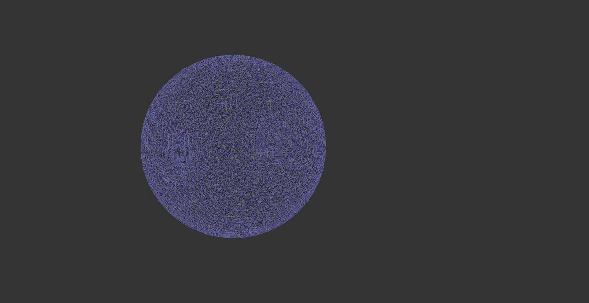

<div>
<a herf="./README.zh-CN.md">简体中文</a> |
<a herf="./README.zh-CN.md">English</a>
</div>

# <center> poseGraphOpt
使用G2O进行位姿图优化，该项目的内容如下：
- 使用g2o/types/slam中定义的`VertexSE3`和`EdgeSE3`实现位姿图优化
- 使用自定义的`VertexSE3`和`EdgeSE3`实现位姿图优化

## 1. 项目依赖

- [Ceres 2.1.0 安装指南](http://ceres-solver.org/installation.html)
- [G2O 20230223 安装指南](https://github.com/RainerKuemmerle/g2o/releases)
- [Eigen 3.4 安装指南](https://gitlab.com/libeigen/eigen/-/releases/3.4.0)
- [Sophus 1.22.10 安装指南](https://github.com/strasdat/Sophus/releases/tag/1.22.10)
- 值得注意的是，需要正确安装`g2o_viewer`

## 2. 位姿图优化问题拆解
```shell
poseGraphOpt
├── cmake                                # cmake脚本文件夹
│   ├── FindEigen3.cmake
│   └── FindG2O.cmake
├── CMakeLists.txt                       # 根目录的cmake文件
├── g2oMyself                            # 自定义顶点和边文件夹
│   ├── CMakeLists.txt
│   ├── include                          # g2oMyself头文件
│   │   ├── EdgeSE3.h                    # 声明EdgeSE3 类的头文件
│   │   └── VertexSE3.h                  # 声明VertexSE3 类的头文件
│   └── src                              # g2oMyself 源文件
│       ├── EdgeSE3.cpp                  # 定义EdgeSE3 类的源文件
│       └── VertexSE3.cpp                # 定义VertexSE3 类的源文件
├── g2oSE3                               # g2oSE3类文件夹
│   ├── CMakeLists.txt                   
│   ├── include                          # g2oSE3类头文件目录
│   │   └── g2oSE3.h                     # g2oSE3类头文件
│   └── src
│       └── g2oSE3.cpp                   # g2oSE3类源文件
├── LICENSE
├── main.cpp                             # 项目入口
├── README.md
├── res
│   └── sphere.g2o                       # 待优化的位姿图文件
└── result
    └── result.g2o                       # 优化完成的位姿图文件
```
<div align="center">
    
</div>

根目录的CMakeLists.txt文件中，可以通过更改`option()`函数可以切换是否利用G2O本身slam模块或者利用自定义模块

- `option(USE_MYSELF "use myself define or not" ON)`启用自定义的李代数顶点和李代数边
- `option(USE_MYSELF "use myself define or not" OFF)`启用g2o库本身的李代数顶点和李代数边

## 3. sphere.g2o文件说明
<div align="center">
    
</div>

- `VERTEX_SE3:QUAT`:代表采用四元素表示的G2O的VertexSE3顶点
- 其余数据从左至右分别为
  - 顶点id
  - 平移向量$(t_x, t_y, t_z)$
  - 四元素$(q_x, q_y, q_z, q_w)$ 

<div align="center">
    
</div>

- `EDGE_SE3:QUAT`:代表采用四元素表示的G2O的`EdgeSE3`优化边
- 其余数据从左至右分别为
  - 左顶点id，右顶点id
  - 从左顶点至又顶点的平移向量差值$(\delta t_x, \delta t_y, \delta t_z)$
  - 从左顶点至又顶点的四元素差值 $(\delta q_x, \delta q_y, \delta q_z, \delta q_w)$
  - 信息矩阵的上三角部分（信息矩阵为对称阵，这是由于高斯分布的协方差矩阵决定的）

## 4. 项目运行

### 4.1 指定使用构建方式
```cmake
option(USE_MYSELF "use myself define or not" ON) # 启用自定义的李代数顶点和李代数边
option(USE_MYSELF "use myself define or not" OFF) # 启用g2o库本身的李代数顶点和李代数边
```
注意在修改`USE_MYSELF`变量时，需要删除构建目录，这是由于cmake中的option变量带有缓存的效果而造成的

### 4.2 构建和运行项目
```shell
mkdir build
cd build
```

```shell
cmake ..
cmake --build .
```

```shell
g2oSE3 initFilePath maxIterations resultFilePath
```
- `initFilePath`: 待优化的位姿图文件路径 ../res/sphere.g2o
- `maxIterations`: 指定最大迭代次数
- `resultFilePath`: 指定优化后的位姿图文件路径 ../result/result.g2o

```shell
cd ../result
g2o_viewer result.g2o
```

## 5. 结果
<div align="center">
    <div>
        <p>优化前：</p>
        
    </div>
    <div>
        <p>优化后：</p>
        
    </div>
</div>